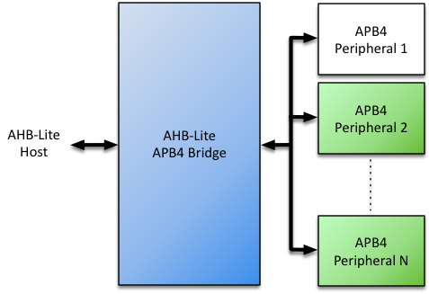
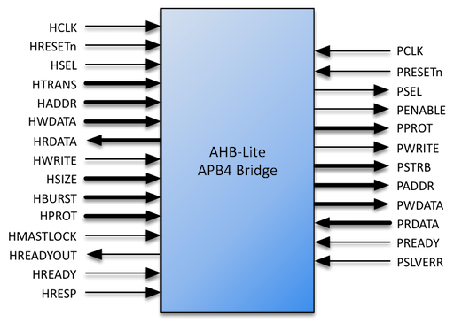

# AHB-Lite APB4 Bridge Datasheet

## Contents

-   [Introduction](#sec:introduction)
-   [Specifications](#specifications)
-   [Configurations](#configurations)
-   [Interfaces](#interfaces)
-   [Resources](#resources)
-   [Revision History](#revision-history)

## Introduction

The Roa Logic AHB-Lite APB4 Bridge is a fully parameterized soft IP interconnect bridge between the *AMBA 3 AHB-Lite v1.0* and *AMBA APB v2.0* bus protocols.

The AHB-Lite APB4 Bridge natively supports a *single* peripheral, however *multiple* APB4 peripherals may be connected to a single bridge by including supporting multiplexer logic – See the *AMBA APB v2.0 Protocol* specification. An *APB4 Multiplexer* IP implementing this capability is available from Roa Logic

### Features

-   Full support for AMBA 3 AHB-Lite and APB version 2.0 (APB4) protocol

-   Fully parameterized

-   Unlimited APB4 address and data widths supported

-   Configurable number of peripheral-side byte lanes with automatic handling of burst transfers

-   Support for separate clock domain per interface with automatic handling of cross-domain timing.

## Specifications

### Functional Description

The Roa Logic AHB-Lite APB4 Bridge is a highly configurable, fully parameterized soft IP interconnect bridge between the *AMBA 3 AHB-Lite v1.0* and *AMBA APB v2.0* bus protocols.

These protocols are commonly referred to as AHB-Lite and APB4 respectively – these terms will be used throughout this datasheet. All signals defined in the AHB-Lite and APB4 specifications are fully supported.

The IP contains 2 interfaces; an AHB-Lite Slave Interface and an APB4 Master Interface. Transactions received on the AHB-Lite Slave Interface are translated into APB4 transactions on the APB4 Master Interface. The IP automatically generates APB4 burst transactions if the APB4 data width is less than the AHB-Lite data width.

Each interface can operate on a separate clock domain and the IP automatically handles all cross clock domain synchronization requirements.

|  **Notes:**|                                                                                                         |
|-----------:|:--------------------------------------------------------------------------------------------------------|
|          1.| The APB4 Interface clock frequency must be less than or equal to the AHB-Lite interface clock frequency |
|          2.| The APB4 Interface data width must be less than or equal to the data width of the AHB-Lite interface    |
|          3.| AHB-Lite and APB4 Interface data widths must be an integer multiple of bytes.                           |

### AHB-Lite Interface

An AHB-Lite Bus Master connects to the AHB interface of the AHB-Lite APB4 Bridge. The AHB interface is implemented as a regular AHB-Lite Slave Interface, supporting all signals in the *AMBA 3 AHB-Lite v1.0* protocol specification

### APB4 Interface

An APB4 Bus Slave connects to the APB interface of the Bridge IP. The APB port is implemented as a regular APB4 Master Interface supporting all signals of the *AMBA APB v2.0* protocol specification. This allows a single APB4 Peripheral to be connected directly to the Interface without further logic requirements.

Multiple peripherals can share the APB4 Interface through appropriate decoding and multiplexing of the interface signals. Roa Logic provides an additional APB4 Multiplexer IP to implement this capability.

## Configurations

### Introduction

The Roa Logic AHB-Lite APB4 Bridge is a fully configurable bridge IP to enable AHB-Lite based hosts to communicate with APB4 based peripherals. The core parameters and configuration options are described in this section.

### Core Parameters

| Parameter    |   Type  | Default | Description                       |
|:-------------|:-------:|:-------:|:----------------------------------|
| `HADDR_SIZE` | Integer |    32   | AHB-Lite Address Bus Size         |
| `HDATA_SIZE` | Integer |    32   | AHB-Lite Data Bus Size            |
| `PADDR_SIZE` | Integer |    10   | APB4 Address Bus Size             |
| `PDATA_SIZE` | Integer |    8    | APB4 Data Bus Size                |
| `SYNC_DEPTH` | Integer |    3    | Clock Domain Crossing Sync Stages |

#### HADDR\_SIZE

The `HADDR_SIZE` parameter specifies the width of the address bus for the AHB-Lite interface.

#### HDATA\_SIZE

The `HDATA_SIZE` parameter specifies the width of the data bus for the AHB-Lite interface. This parameter must equal an integer multiple of bytes and also be greater or equal to `PDATA_SIZE`:

|  **Conditions**:|                             |
|----------------:|:----------------------------|
|               1.| `HDATA_SIZE` ≥ `PDATA_SIZE` |
|               2.| `HDATA_SIZE MOD 8 = 0`      |

#### PADDR\_SIZE

The `PADDR_SIZE` parameter specifies the width of the address bus for the APB4 (i.e. peripheral) interface.

#### PDATA\_SIZE

The `PDATA_SIZE` parameter specifies the width of the data bus for APB4 (i.e. peripheral) interface. This parameter must equal an integer multiple of bytes and also be less than or equal to `HDATA_SIZE`.

|  **Conditions**:|                             |
|----------------:|:----------------------------|
|               1.| `PDATA_SIZE` ≤ `HDATA_SIZE` |
|               2.| `PDATA_SIZE MOD 8 = 0`      |

#### SYNC\_DEPTH

The APB4 Bridge IP supports operating the AHB-Lite and APB4 interfaces in separate, unrelated clock domains. The IP automatically handles cross-domain synchronization and the `SYNC_DEPTH` parameter determines the number of synchronization stages between these clock domains.

Increasing this parameter reduces the possibility of metastability for signals crossing between the two domains, but at the cost of increased latency.

The minimum and default value of the `SYNC_DEPTH` parameter is 3.

#### Limits to APB4 Address & Data Sizes

The *AMBA APB v2.0 Protocol* specification limits the widths of both Address (`PADDR_SIZE`) and Data (`PDATA_SIZE`) buses to 32 bits. However the AHB-Lite APB4 Bridge IP Address and Data sizes are *not* similarly constrained – any Address width and any byte-aligned Data width is supported by the IP.

## Interfaces

### AHB-Lite Interface

The AHB-Lite interface is a regular AHB-Lite slave port. All signals are supported. See the *[AMBA 3 AHB-Lite Specification](https://www.arm.com/products/system-ip/amba-specifications)* for a complete description of the signals.

|   **Port**  |   **Size**   | **Direction** | **Description**               |
|:-----------:|:------------:|:-------------:|:------------------------------|
|  `HRESETn`  |       1      |     Input     | Asynchronous active low reset |
|    `HCLK`   |       1      |     Input     | Clock Input                   |
|    `HSEL`   |       1      |     Input     | Bus Select                    |
|   `HTRANS`  |       2      |     Input     | Transfer Type                 |
|   `HADDR`   | `HADDR_SIZE` |     Input     | Address Bus                   |
|   `HWDATA`  | `HDATA_SIZE` |     Input     | Write Data Bus                |
|   `HRDATA`  | `HDATA_SIZE` |     Output    | Read Data Bus                 |
|   `HWRITE`  |       1      |     Input     | Write Select                  |
|   `HSIZE`   |       3      |     Input     | Transfer Size                 |
|   `HBURST`  |       3      |     Input     | Transfer Burst Size           |
|   `HPROT`   |       4      |     Input     | Transfer Protection Level     |
| `HREADYOUT` |       1      |     Output    | Transfer Ready Output         |
|   `HREADY`  |       1      |     Input     | Transfer Ready Input          |
|   `HRESP`   |       1      |     Output    | Transfer Response             |

#### HRESETn

When the active low asynchronous `HRESETn` input is asserted (‘0’), the interface is put into its initial reset state.

#### HCLK

`HCLK` is the interface system clock. All internal logic for the AHB-Lite interface operates at the rising edge of this system clock and AHB bus timings are related to the rising edge of `HCLK`.

#### HSEL

The AHB-Lite interface only responds to other signals on its bus – with the exception of the global asynchronous reset signal `HRESETn` – when `HSEL` is asserted (‘1’). When `HSEL` is negated (‘0’) the interface considers the bus `IDLE`.

#### HTRANS

HTRANS indicates the type of the current transfer as shown in Table \[tab:HTRANS\]

| **`HTRANS`** | **Type** | **Description**                                                                          |
|:------------:|:--------:|:-----------------------------------------------------------------------------------------|
|     `00`     |  `IDLE`  | No transfer required                                                                     |
|     `01`     |  `BUSY`  | Connected master is not ready to accept data, but intents to continue the current burst. |
|     `10`     | `NONSEQ` | First transfer of a burst or a single transfer                                           |
|     `11`     |   `SEQ`  | Remaining transfers of a burst                                                           |

#### HADDR

`HADDR` is the address bus. Its size is determined by the `HADDR_SIZE` parameter and is driven to the connected peripheral.

#### HWDATA

`HWDATA` is the write data bus. Its size is determined by the `HDATA_SIZE` parameter and is driven to the connected peripheral.

#### HRDATA

`HRDATA` is the read data bus. Its size is determined by the `HDATA_SIZE` parameter and is sourced by the connected peripheral.

#### HWRITE

`HWRITE` is the read/write signal. `HWRITE` asserted (‘1’) indicates a write transfer.

#### HSIZE

`HSIZE` indicates the size of the current transfer as shown in table \[tab:HSIZE\]:

| **`HSIZE`** | **Size** | **Description** |
|:-----------:|:--------:|:----------------|
|    `000`    |   8 bit  | Byte            |
|    `001`    |  16 bit  | Half Word       |
|    `010`    |  32 bit  | Word            |
|    `011`    |  64 bits | Double Word     |
|    `100`    |  128 bit |                 |
|    `101`    |  256 bit |                 |
|    `110`    |  512 bit |                 |
|    `111`    | 1024 bit |                 |

#### HBURST

HBURST indicates the transaction burst type – a single transfer or part of a burst.

| **`HBURST`** | **Type** | **Description**              |
|:------------:|:--------:|:-----------------------------|
|     `000`    | `SINGLE` | Single access\*\*            |
|     `001`    |  `INCR`  | Continuous incremental burst |
|     `010`    |  `WRAP4` | 4-beat wrapping burst        |
|     `011`    |  `INCR4` | 4-beat incrementing burst    |
|     `100`    |  `WRAP8` | 8-beat wrapping burst        |
|     `101`    |  `INCR8` | 8-beat incrementing burst    |
|     `110`    | `WRAP16` | 16-beat wrapping burst       |
|     `111`    | `INCR16` | 16-beat incrementing burst   |

#### HPROT

The `HPROT` signals provide additional information about the bus transfer and are intended to implement a level of protection.

| **Bit\#** | **Value** | **Description**                |
|:---------:|:---------:|:-------------------------------|
|     3     |     1     | Cacheable region addressed     |
|           |     0     | Non-cacheable region addressed |
|     2     |     1     | Bufferable                     |
|           |     0     | Non-bufferable                 |
|     1     |     1     | Privileged Access              |
|           |     0     | User Access                    |
|     0     |     1     | Data Access                    |
|           |     0     | Opcode fetch                   |

#### HREADYOUT

`HREADYOUT` indicates that the current transfer has finished. Note, for the AHB-Lite PLIC this signal is constantly asserted as the core is always ready for data access.

#### HREADY

`HREADY` indicates whether or not the addressed peripheral is ready to transfer data. When `HREADY` is negated (‘0’) the peripheral is not ready, forcing wait states. When `HREADY` is asserted (‘1’) the peripheral is ready and the transfer completed.

#### HRESP

`HRESP` is the instruction transfer response and indicates OKAY (‘0’) or ERROR (‘1’).

### APB4 (Peripheral) Interface

The APB4Interface is a regular APB4 Master Interface. All signals defined in the protocol are supported as described below. See the *AMBA APB Protocol v2.0 Specifications* for a complete description of the signals.

| Port      |      Size      | Direction | Description                   |
|:----------|:--------------:|:---------:|:------------------------------|
| `PRESETn` |        1       |   Input   | Asynchronous active low reset |
| `PCLK`    |        1       |   Input   | Clock Input                   |
| `PSEL`    |        1       |   Output  | Peripheral Select             |
| `PENABLE` |        1       |   Output  | Peripheral Enable Control     |
| `PPROT`   |        3       |   Output  | Transfer Protection Level     |
| `PWRITE`  |        1       |   Output  | Write Select                  |
| `PSTRB`   | `PDATA_SIZE/8` |   Output  | Byte Lane Indicator           |
| `PADDR`   |  `PADDR_SIZE`  |   Output  | Address Bus                   |
| `PWDATA`  |  `PDATA_SIZE`  |   Output  | Write Data Bus                |
| `PRDATA`  |  `PDATA_SIZE`  |   Input   | Read Data Bus                 |
| `PREADY`  |        1       |   Input   | Transfer Ready Input          |
| `PSLVERR` |        1       |   Input   | Transfer Error Indicator      |

#### PRESETn

When the active low asynchronous `PRESETn` input is asserted (‘0’), the APB4 interface is put into its initial reset state.

#### PCLK

`PCLK` is the APB4 interface system clock. All internal logic for the APB4 interface operates at the rising edge of this system clock and APB4 bus timings are related to the rising edge of `PCLK`.

The frequency of `PCLK` must be less than or equal to that of the AHB-Lite Interface clock `HCLK`:

|  **Conditions**:|                                 |
|----------------:|:--------------------------------|
|                 | Freq( `PCLK` ) ≤ Freq( `HCLK` ) |

#### PSEL

The APB4 Bridge generates `PSEL`, signaling to an attached peripheral that it is selected and a data transfer is pending.

| **Note:** |                                                                                                                                                                                       |
|:----------|:--------------------------------------------------------------------------------------------------------------------------------------------------------------------------------------|
|           | To support multiple APB4 peripherals, individual `PSEL` signals must be generated per peripheral - Roa Logic provides an additional *APB4 Multiplexer* IP to support this requirement |

#### PENABLE

The APB4 Bridge asserts `PENABLE` during the second and subsequent cycles of an APB4 data transfer.

#### PPROT

`PPROT[2:0]` indicates the protection type of the data transfer, with 3 levels of protection supported as follows:

| Bit\# | Value | Description        |
|:------|:------|:-------------------|
| 2     | 1     | Instruction Access |
|       | 0     | Data Access        |
| 1     | 1     | Non-Secure Access  |
|       | 0     | Secure Access      |
| 0     | 1     | Privileged Access  |
|       | 0     | Normal Access      |

#### PWRITE

`PWRITE` indicates a data write access when asserted high (‘1’) and a read data access when de-asserted (‘0’)

#### PSTRB

There is one `PSTRB` signal per byte lane of the APB4 write data bus (`PWDATA`). These signals indicate which byte lane to update during a write transfer such that `PSTRB[n]` corresponds to `PWDATA[(8n+7):8n]`.

#### PADDR

`PADDR` is the APB4 address bus. The bus width is defined by the `PADDR_SIZE` parameter and is driven by the APB4 Bridge core.

#### PWDATA

`PWDATA` is the APB4 write data bus and is driven by the APB4 Bridge core during write cycles, indicated when `PWRITE` is asserted (‘1’). The bus width must be byte-aligned and is defined by the `PDATA_SIZE` parameter.

#### PRDATA

`PRDATA` is the APB4 read data bus. An attached peripheral drives this bus during read cycles, indicated when `PWRITE` is de-asserted (‘0’). The bus width must be byte-aligned and is defined by the `PDATA_SIZE` parameter.

#### PREADY

`PREADY` is driven by the attached peripheral. It is used to extend an APB4 transfer.

#### PSLVERR

`PSLVERR` indicates a failed data transfer when asserted (‘1’). As APB4 peripherals are not required to support this signal it must be tied LOW (‘0’) when unused.

## Resources

Below are some example implementations for various platforms. All implementations are push button, no effort has been undertaken to reduce area or improve performance.

| Platform | DFF | Logic Cells | Memory | Performance (MHz) |
|:---------|:----|:------------|:-------|:------------------|
|          |     |             |        |                   |
|          |     |             |        |                   |
|          |     |             |        |                   |

(This table will be updated in future)

## Revision History

| Date        | Rev. | Comments        |
|:------------|:----:|:----------------|
| 13-Oct-2017 |  1.0 | Initial Release |
|             |      |                 |
|             |      |                 |
|             |      |                 |
