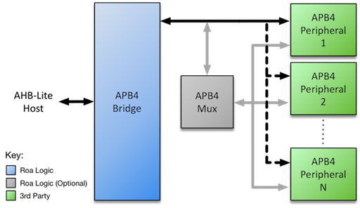

# AHB-Lite APB4 Bridge

The Roa Logic AHB-Lite APB4 Bridge is a fully parameterized soft IP interconnect bridge between the [AMBA 3 AHB-Lite v1.0 ](http://infocenter.arm.com/help/index.jsp?topic=/com.arm.doc.ihi0024c/index.html) and [AMBA APB v2.0](http://infocenter.arm.com/help/topic/com.arm.doc.ihi0024c/index.html) bus protocols.

The AHB-Lite APB4 Bridge natively supports a *single* peripheral, however *multiple* APB4 peripherals may be connected to a single bridge by including supporting multiplexer logic – See the [AMBA APB v2.0 Protocol](http://infocenter.arm.com/help/topic/com.arm.doc.ihi0024c/index.html) specification. An [APB4 Multiplexer](https://roalogic.com/portfolio/apb4-multiplexer/) IP implementing this capability is available from Roa Logic

## Documentation

- [Datasheet](DATASHEET.md)
  - [PDF Datasheet](docs/anb3lite_apb_bridge_datasheet.pdf)

## Features

- Full support for AMBA 3 AHB-Lite and APB version 2.0 (APB4) protocol
- Fully parameterized
- Unlimited APB4 address and data widths supported
- Configurable number of peripheral-side byte lanes with automatic handling of burst transfers
- Support for separate clock domain per interface with automatic handling of cross-domain timing.

## Interfaces
- AHB3-Lite slave interface
- APB master interface

## License

Released under the RoaLogic [Non-Commercial License](/LICENSE.md)

## Dependencies
This release requires the ahb3lite package found here https://github.com/RoaLogic/ahb3lite_pkg
